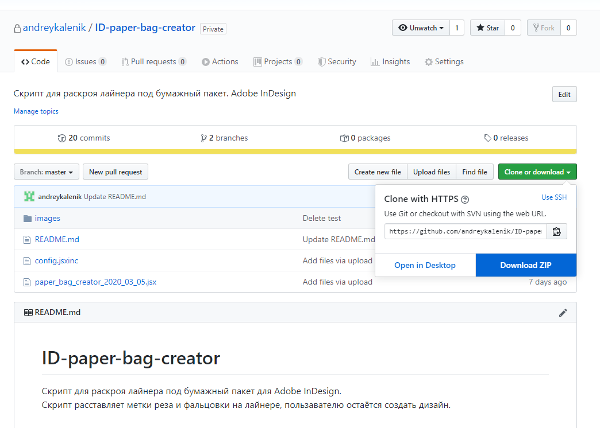
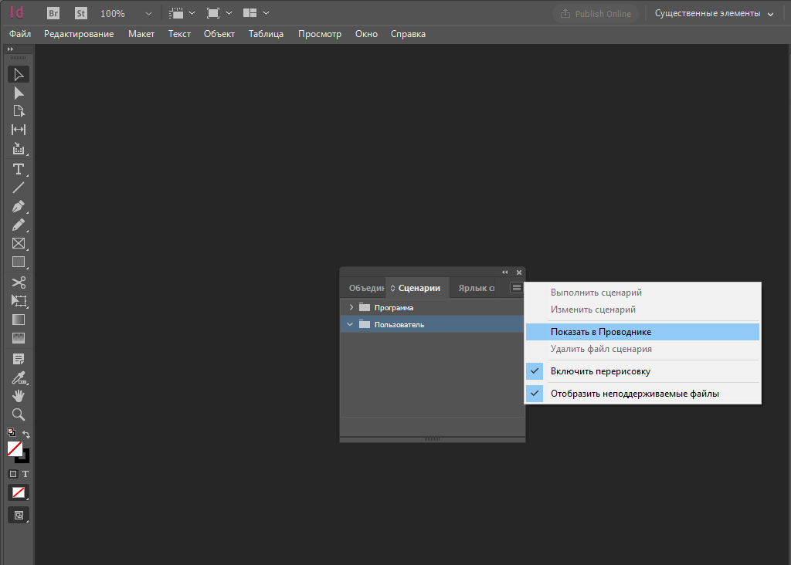
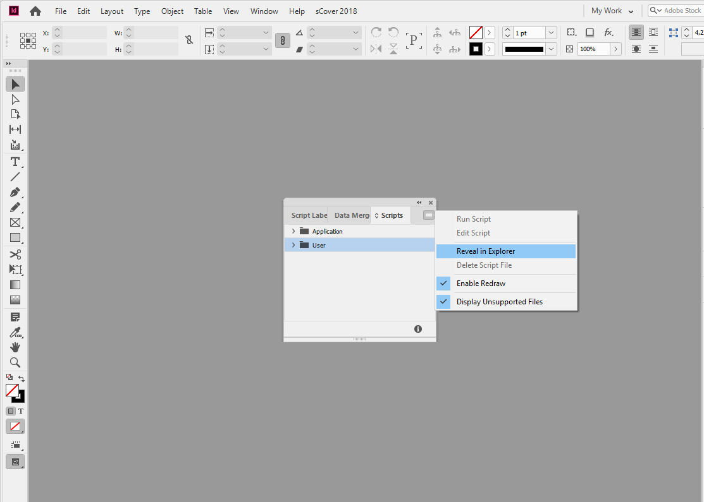

# ID-paper-bag-creator
Скрипт для раскроя лайнера под бумажный пакет для  Adobe InDesign.   Скрипт расставляет метки реза и фальцовки на лайнере, пользавателю остаётся создать дизайн.

# Установка

1. Скачать архив с GitHub-a 
       
       
2. Содержимое архива поместить по адресу:   C:\Users\user_name\AppData\Roaming\Adobe\InDesign\Version 15.0\ru_RU\Scripts\Scripts Panel
     > **user_name** — имя пользователя в ОС Windows.  
      **Version 15.0**  — версия InDesign CC2020 — 15, CC2019-14, CC2018-13 и тд. 
      **ru_RU** - если InDesign на русском языке, **en_US** - англиском. 
       
       
      

# Использование

# Настройка
