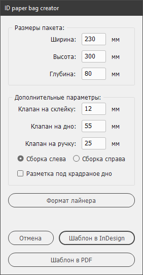

# ID-paper-bag-creator

Скрипт для раскроя лайнера бумажного пакета из двух частей для  Adobe InDesign.   Скрипт расставляет метки реза и фальцовки на лайнере, пользователю остаётся создать дизайн в InDesign или сохранить шаблон лайнера в формате PDF.

# Установка

1. Скачать [архив с GitHub-a](images/get-zip-1.png). 

       

2. Содержимое архива поместить по адресу:   C:\Users\user_name\AppData\Roaming\Adobe\InDesign\Version 15.0\ru_RU\Scripts\Scripts Panel

     > **user_name** — имя пользователя в ОС Windows.  

      **Version 15.0**  — версия InDesign CC2020 — 15, CC2019-14, CC2018-13 и тд. 

      **[ru_RU](images/install_ru.png)** - если InDesign на русском языке, **[en_US](images/install_en.png)** - англиском. 

3. Перезапустить  InDesign.

ссылка на ютьюб

# Использование

Указать параметры пакета, при необходтмости изменить параметры сборки: размеры клапанов, сторону сборки.

Если ширина равна глубине - используйте опцию "Разметка под квадратное дно", скрипт нарисует скошенные клапаны.

# Настройка

**config.jsxinc** - файл надстроек, содержит размеры по умолчанию, тип пакета и сторону сборки, толщину, длину и цвет меток.   Открывается в любом текстовом редакторе. 

